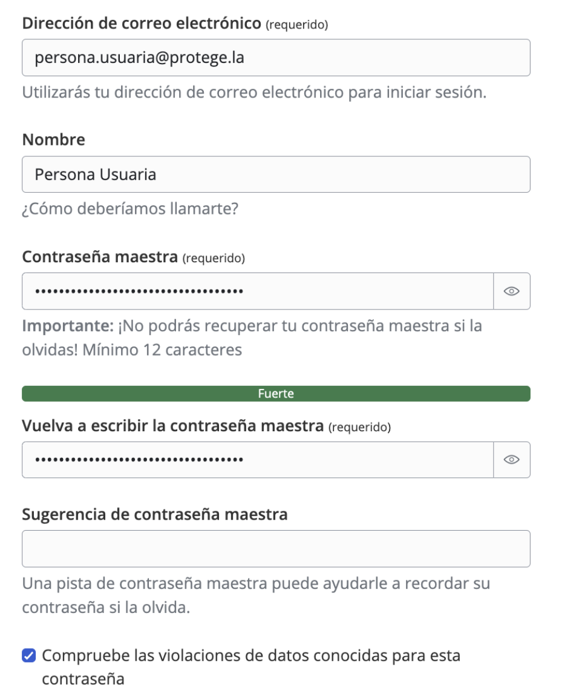
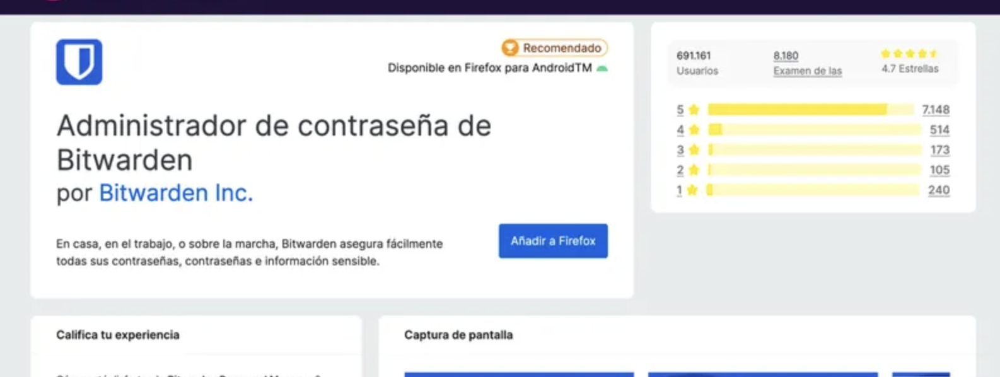
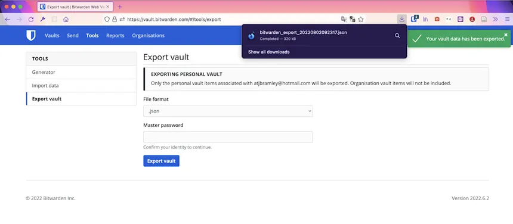

# **Fase 2 – Guia d’Ús Tècnica: Bitwarden**

## **1. Introducció**

Aquesta guia té com a objectiu oferir instruccions pas a pas per a la **instal·lació, configuració i ús bàsic** de Bitwarden, el gestor de contrasenyes recomanat per la Direcció Tècnica d’EverPia.  

L’objectiu és garantir que tot el personal tècnic pugui emmagatzemar i gestionar credencials de manera segura, seguint bones pràctiques de ciberseguretat.

---

## **2. Instal·lació i Configuració Inicial**

### **2.1. Creació del compte Bitwarden**

1. Accediu al web oficial: [https://bitwarden.com](https://bitwarden.com)  
2. Feu clic a **“Get Started”** o **“Create Account”**.  
3. Introduïu:
   - **Email corporatiu**
   - **Nom complet**
   - **Contrasenya mestra** → Ha de ser **llarga, única i fàcil de recordar** (recomanat: passphrase de mínim 16 caràcters).
4. Accepteu els termes i feu clic a **“Submit”**.  
5. Rebreu un correu de verificació. Feu clic a l’enllaç per activar el compte.

⚠️ **Important:** La *contrasenya mestra* no es pot recuperar. Si es perd, s’hauran de restablir totes les dades.

---

### **2.2. Instal·lació de l’aplicació d’escriptori**

1. Aneu a: [https://bitwarden.com/download/](https://bitwarden.com/download/)  
2. Trieu la versió segons el vostre sistema operatiu (Windows, macOS o Linux).  
3. Executeu el fitxer d’instal·lació i inicieu sessió amb el vostre compte creat.  
4. (Opcional) Instal·leu també l’aplicació mòbil des de **Google Play** o **App Store** per tenir accés sincronitzat.

---

### **2.3. Instal·lació de l’extensió del navegador**

1. Aneu al vostre navegador principal (Chrome, Firefox, Edge, Brave, etc.).  
2. Busqueu **“Bitwarden Password Manager”** al repositori d’extensions.  
3. Feu clic a **“Afegeix al navegador”** i inicieu sessió.  
4. L’icona de Bitwarden apareixerà a la barra d’eines per accedir ràpidament a les credencials i l’autocompletat.

---

## **3. Generació de Contrasenyes Segures**

Bitwarden inclou un **generador de contrasenyes** configurable per crear claus robustes i úniques.

### **3.1. Ús del generador**

1. A l’aplicació o extensió, feu clic a **“Generator”**.  
2. Seleccioneu el tipus:
   - **Password** → combinació aleatòria de caràcters.  
   - **Passphrase** → seqüència de paraules fàcil de recordar.  
3. Configureu els paràmetres:
   - Longitud recomanada: **mínim 16 caràcters**  
   - Incloure **majúscules, números i caràcters especials**
4. Feu clic a **“Regenerate”** fins a obtenir una contrasenya que compleixi les polítiques de seguretat internes.
5. Feu clic a **“Copy”** o **“Save”** per desar-la directament en un element nou.

---

## **4. Exemples d’Ús i Emplenament Automàtic**

### **4.1. Desar una credencial d’un compte de correu**

1. Inicieu sessió al vostre compte de correu corporatiu.  
2. Quan el navegador detecti el formulari d’inici de sessió, Bitwarden oferirà desar la credencial.  
3. Seleccioneu **“Save in Vault”**.  
4. El registre quedarà guardat amb:
   - Nom: *Compte Correu EverPia*
   - URL: https://mail.everpia.com
   - Usuari i contrasenya automàticament.

---

### **4.2. Desar una credencial d’una aplicació o servei web**

1. Obriu Bitwarden → **“Add Item”**.  
2. Completeu:
   - **Nom:** Servei o aplicació  
   - **Usuari:** Nom d’usuari o correu corporatiu  
   - **Contrasenya:** Genereu-ne una amb el generador integrat  
   - **URL:** (opcional, per a autocompletat web)
3. Feu clic a **“Save”**.

---

### **4.3. Ús de l’autocompletat**

1. A qualsevol formulari de login, feu clic a la icona de Bitwarden al navegador.  
2. Si existeix una credencial guardada per aquell domini, apareixerà automàticament.  
3. Seleccioneu-la i les dades s’ompliran de forma segura.

---

## **5. Gestió de Còpies de Seguretat (Backup)**

### **5.1. Exportació del Vault**

1. A l’aplicació d’escriptori o web, aneu a **Settings → Tools → Export Vault**.  
2. Seleccioneu el format **.json (xifrat)**.  
3. Introduïu la vostra contrasenya mestra per autoritzar l’exportació.  
4. Deseu l’arxiu resultant en un dispositiu segur.

---

### **5.2. Emmagatzematge segur de la còpia de seguretat**

Es recomana una de les opcions següents:

- **Opció 1 (recomanada):** Desar l’arxiu exportat en una **clau USB xifrada** (BitLocker o VeraCrypt).  
- **Opció 2:** Emmagatzemar-lo en un **espai al núvol corporatiu xifrat** amb accés limitat (p. ex. Nextcloud, OneDrive empresarial amb 2FA).  
- **Opció 3:** Mantenir una còpia xifrada en un repositori intern protegit per la Direcció Tècnica.

⚠️ **Mai** no deseu el fitxer de backup en ubicacions públiques ni sense xifratge addicional.

---

## **6. Bones Pràctiques Generals**

- No compartiu la contrasenya mestra amb ningú.  
- Activeu sempre **autenticació de doble factor (2FA)** al vostre compte Bitwarden.  
- Actualitzeu regularment l’aplicació i l’extensió del navegador.  
- No utilitzeu Bitwarden per desar credencials personals dins de l’entorn corporatiu.  
- Feu una còpia de seguretat del Vault almenys un cop al mes.  

---

## **7. Suport i Incidències**

Per a qualsevol dubte o problema tècnic relacionat amb Bitwarden, contacteu amb:

**Servei de Seguretat Informàtica – EverPia**  
📧 suport.seguretat@everpia.com  
📞 Extensió 2241  

---

**Document elaborat per:**  
*Departament de Seguretat IT – EverPia*  
**Data:** Octubre 2025
