# Guia LDAP

## Primer configurem els adaptadors de xarxa amb netplan.

## Configurem el segon adaptador de xarxa amb dhcp4 activat,

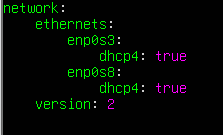

## Ara configurem el hostname i el domini per el servidor, obrim el /etc/hosts

## Escribim el domini server.innovatechXX.test  

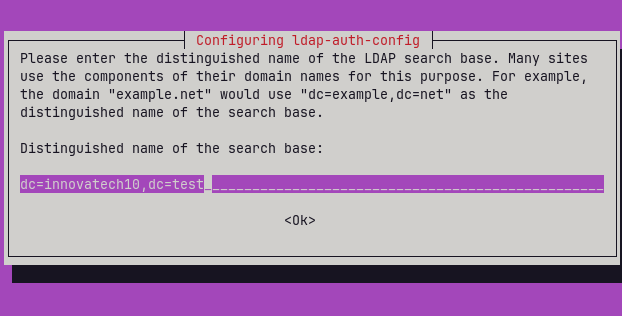

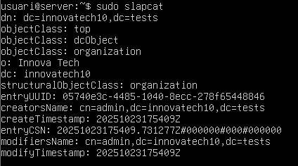

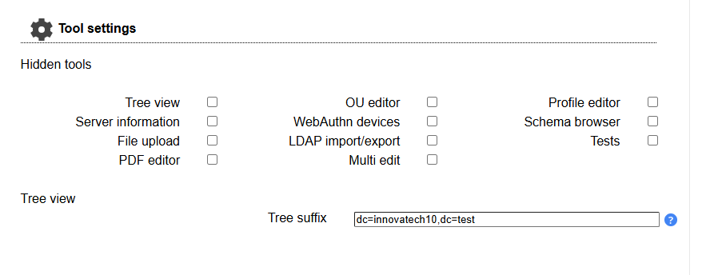

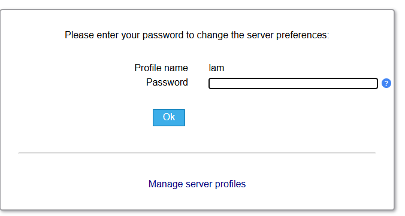

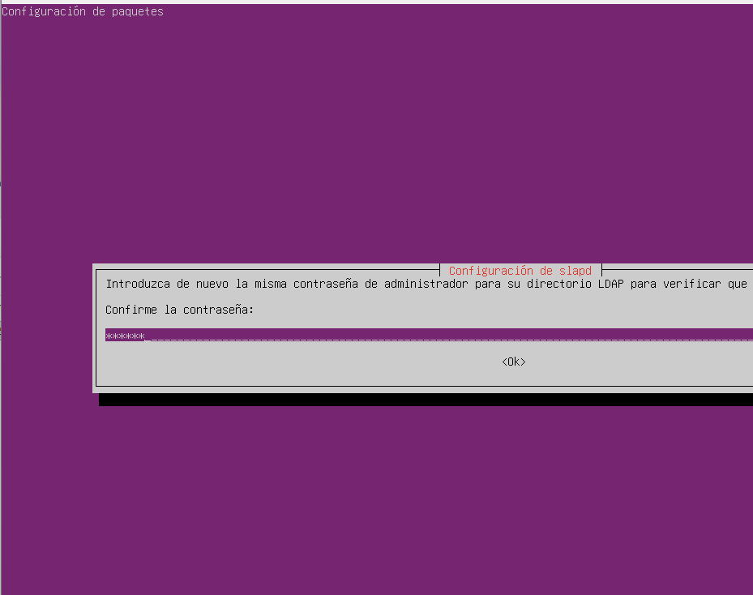

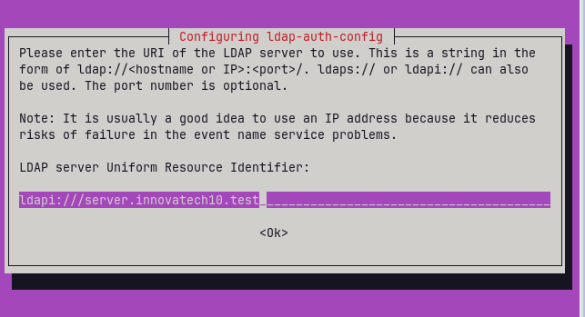

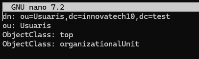

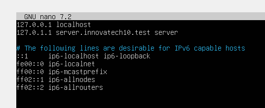

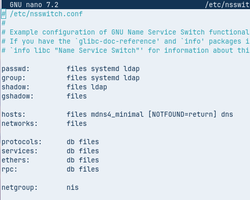

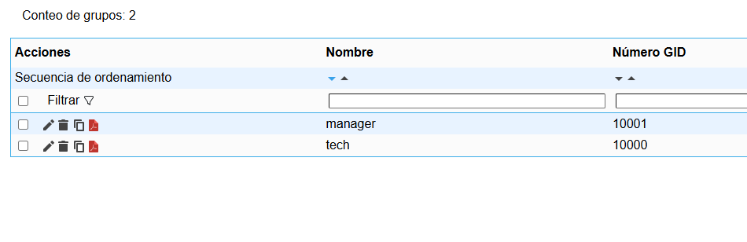

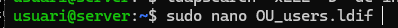

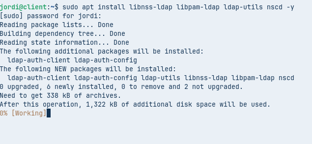

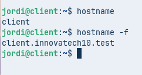

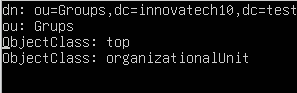

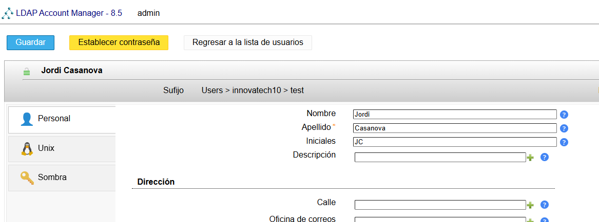

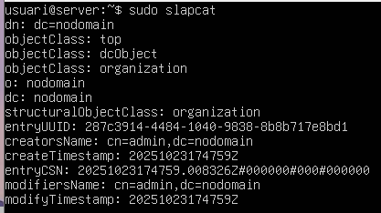

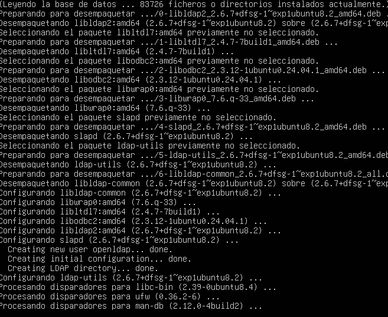

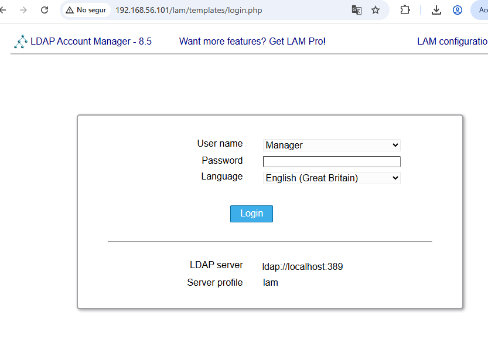

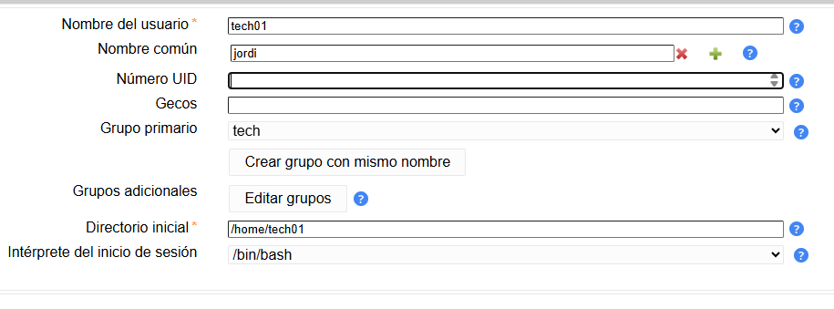

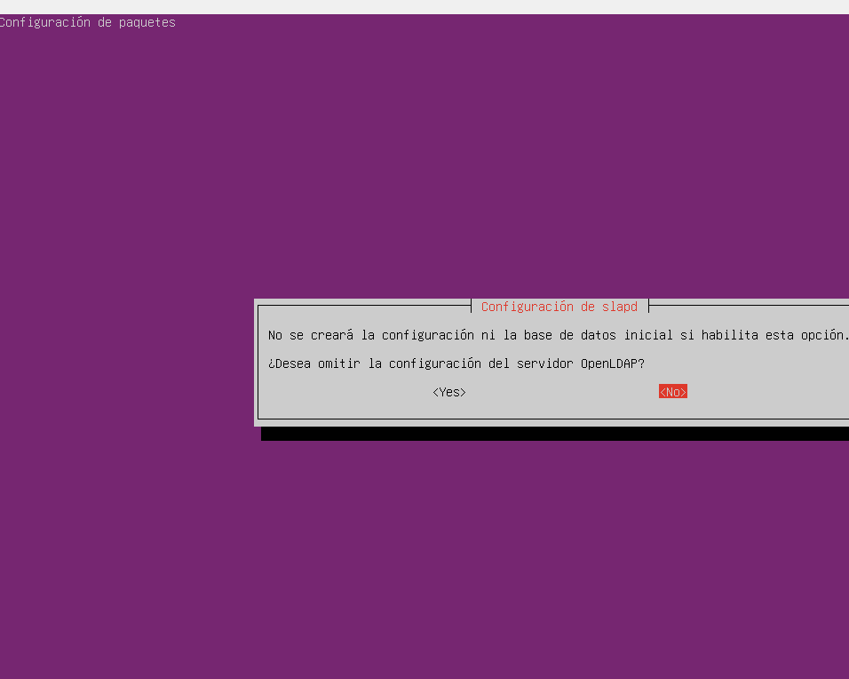

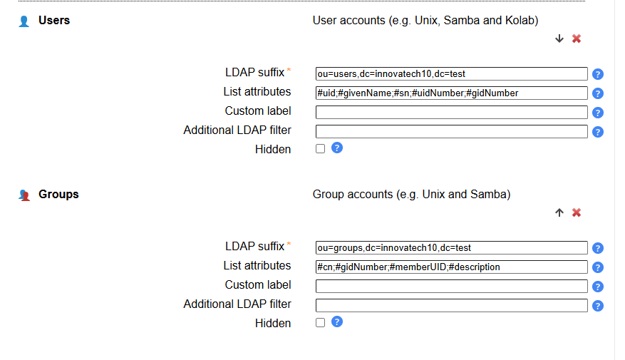

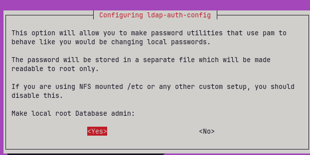

