# 📘 Guia LDAP

## 🖥️ Servidor (Ubuntu Server)

---

### 🔧 Configurem els adaptadors de xarxa amb netplan

---

### 🔧 Configurem el segon adaptador amb DHCP4 activat i apliquem canvis

---

### 🌐 Escribim el domini server.innovatechXX.test (XX és el número de llista)

---

### 🏷️ Posem el hostname

---

### 📦 Instal·lem slapd i ldap-utils

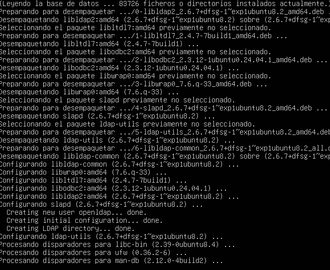

---

### ✔️ Comprovem que el servei slapd funciona

---

### 🔑 Configurem la contrasenya de slapd

---

### ✔️ Verifiquem que la configuració s’ha aplicat correctament

---

### 🗂️ Creem els arxius OU d’usuaris i els afegim a LDAP

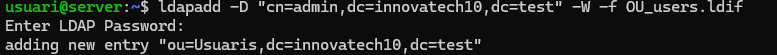

---

### 🗂️ Fem el mateix amb els grups

---

### 🔍 Fem una cerca amb ldapsearch per verificar que tot funciona

---

### 📦 Instal·lem LDAP Account Manager

---

### 🌐 Obrim la web del LAM i accedim a /lam/templates/login.php

---

### 🔐 Entrem amb el LAM configurat

---

### ⚙️ Configurem l’account manager

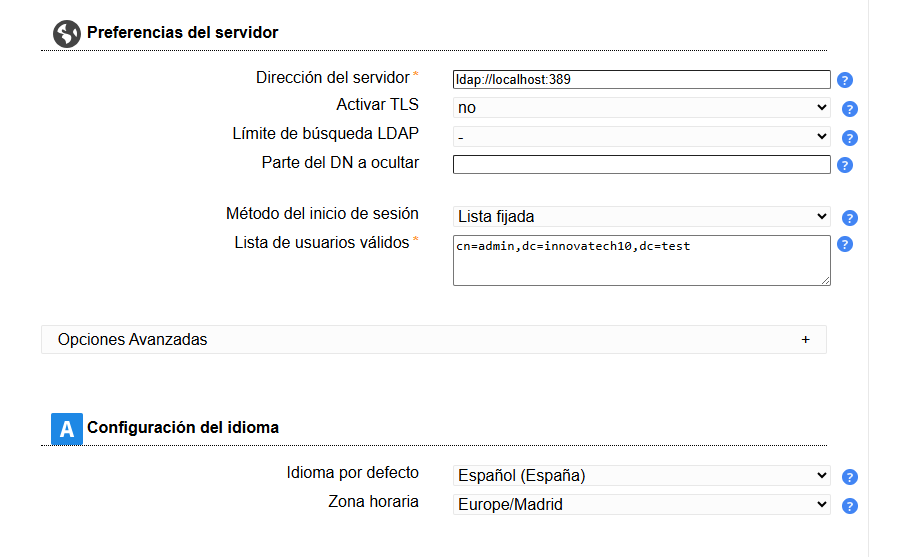

---

### 🔑 Accedim com administrador

---

### ➕ Creem el perfil quan ens aparegui el missatge

---

### 👥 Ara creem els grups i usuaris

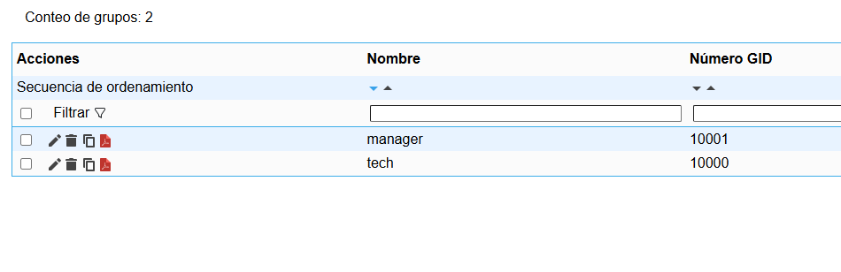

---

# 🖥️ Client

---

### 🔄 Actualitzem el sistema

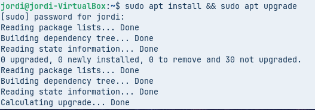

---

### 🏷️ Configurem el hostname i el domini al fitxer /etc/hosts

#### Domini

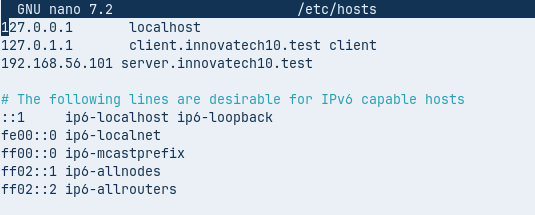

#### Hostname

---

### ✔️ Comprovem que els canvis s’han aplicat

---

### 🌐 Fem un dig per assegurar que el servidor respon

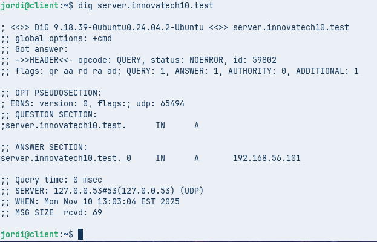

---

### 📦 Instal·lem les utilitats LDAP al client

---

### ⚙️ Configurem LDAP en finalitzar la instal·lació

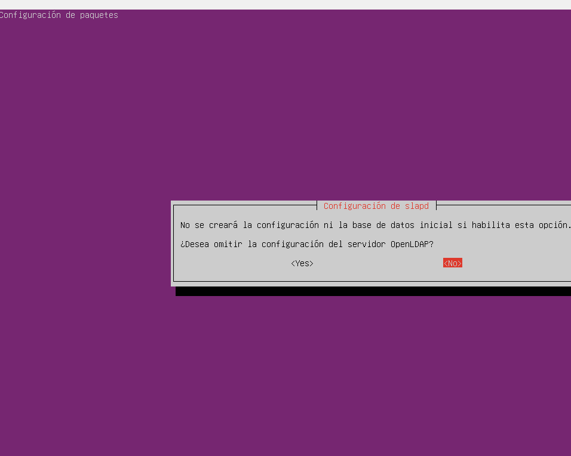

---

### 🔍 Fem un ldapsearch des del client

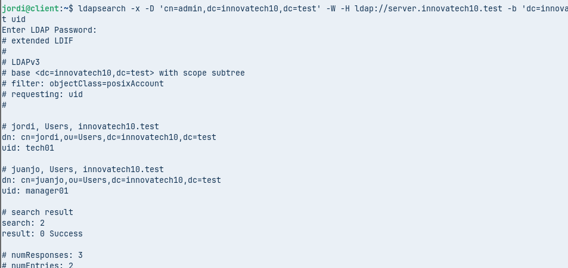

---

# 🔐 Integració PAM i NSS

---

### 🧩 Modifiquem nsswitch per fer servir LDAP

---

### 🔧 Modifiquem /etc/pam.d/common-password (eliminem use_authok)

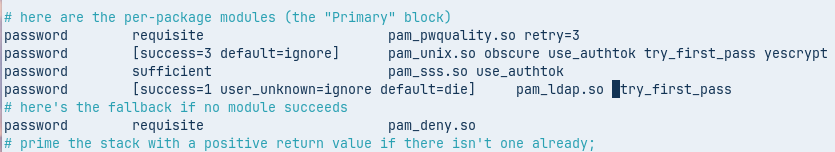

---

### 🧩 Modifiquem /etc/pam.d/common-session per crear perfils automàticament

---

### 👤 Comprovem que s’han creat els usuaris

---

### 📝 Modifiquem gdm-launch-environment per permetre login amb usuaris LDAP

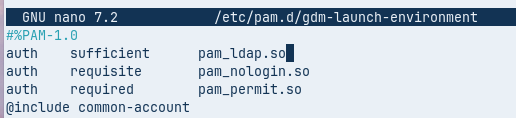

---

### 🔐 Provem el login amb l’usuari tech01 de LDAP

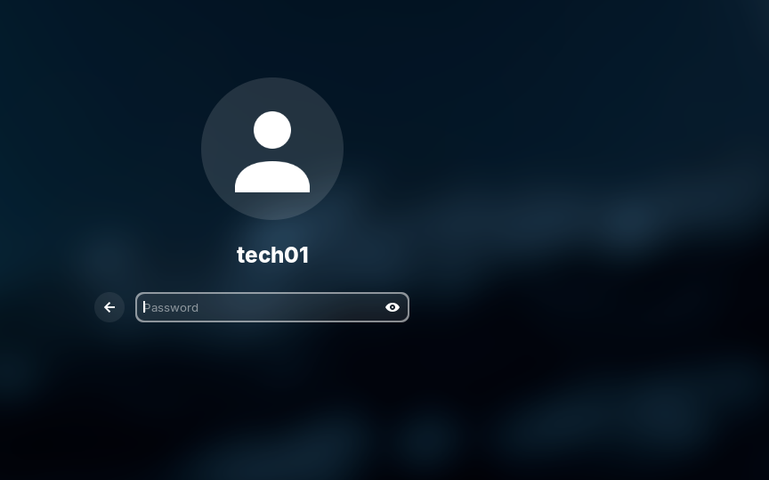

---

# ✅ Ja ens podem loguejar — Finalitzat!
