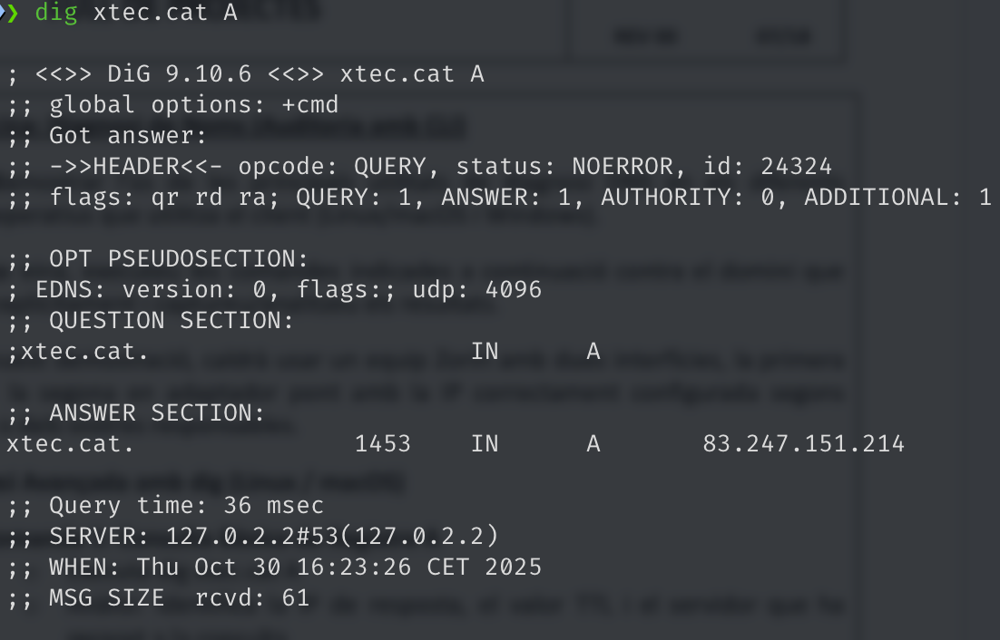
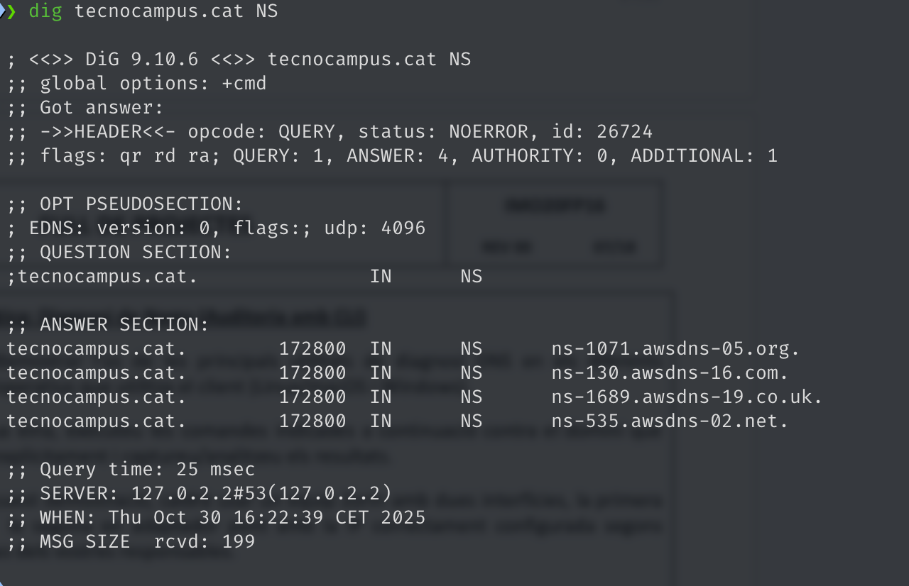
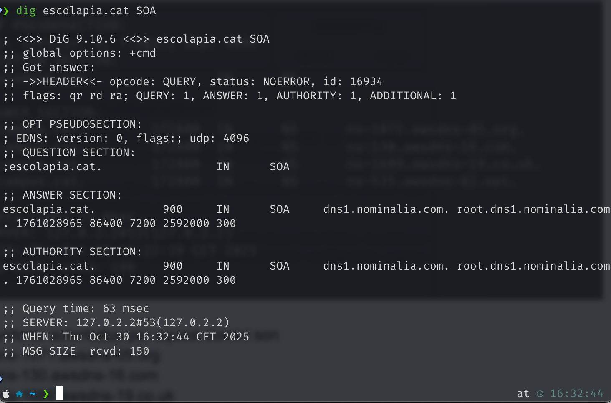
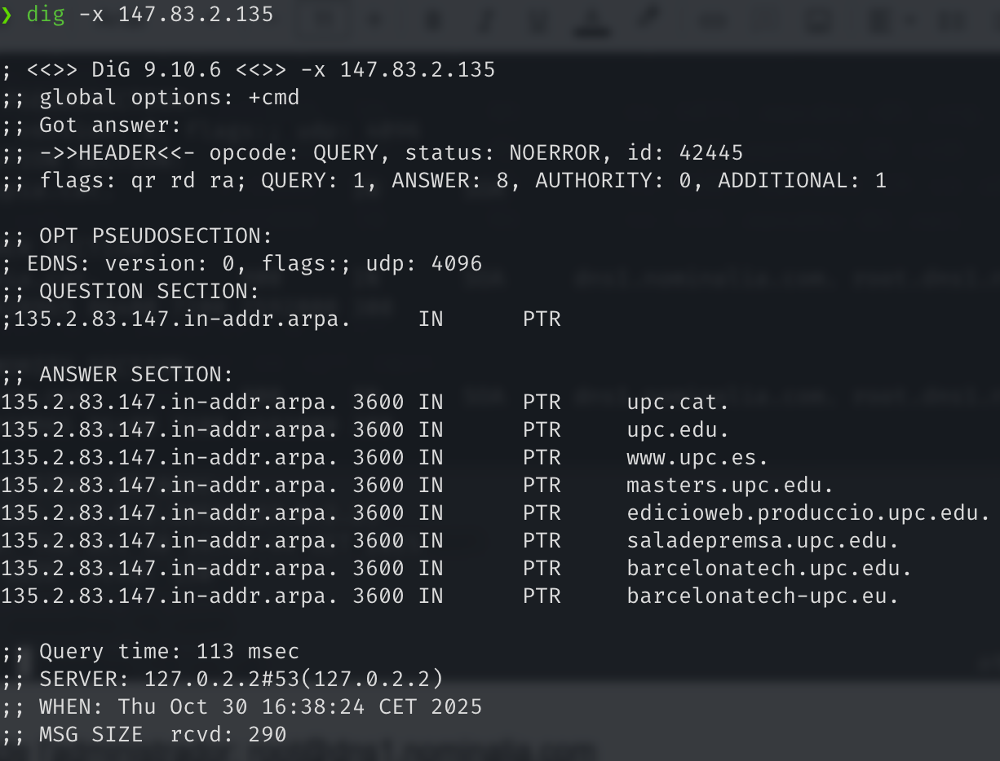
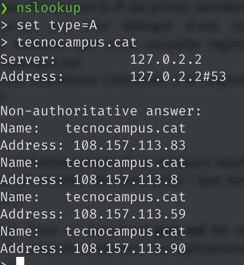
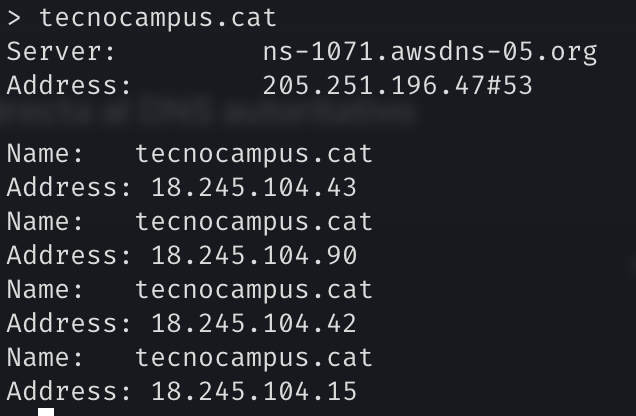

# Fase Práctica: Diagnosi de Noms (Auditoría CLI)

**Objetivo**

Demostrar l'ús de les eines de diagnosi DNS (dig, nslookup i proves locals) en un equip Zorin amb dues interfícies (NAT i pont). S'ha d'executar cada comanda indicada, adjuntar la captura o la sortida, i aportar una anàlisi tècnica i concisa.

---

## Dades

- Data: 2025-11-07
- Entorn: MacOS

---

## A. Diagnosi amb dig (Linux / macOS)

Per a cada apartat, incloure la comanda, la captura o sortida i una anàlisi breu.

### A1 — Consulta A

Comanda:

```
dig xtec.cat A
```

Captura / sortida:



Anàlisi breu:

Resposta: 83.247.151.214. TTL: ~367 s. Servidor que respon: resolutor local (127.0.2.2) — resposta no autoritativa (prové de cache/recursió).

### A2 — Servidors de noms (NS)

Comanda:

```
dig tecnocampus.cat NS
```

Captura / sortida:



Anàlisi breu:

Servidors autoritatius obtinguts:

- ns-1071.awsdns-05.org
- ns-130.awsdns-16.com
- ns-1689.awsdns-19.co.uk
- ns-535.awsdns-02.net

### A3 — SOA

Comanda:

```
dig escolapia.cat SOA
```

Captura / sortida:



Anàlisi breu:

SOA indica administrador: root@dns1.nominalia.com; número de sèrie: 1761028965. Útil per verificar actualitzacions i replicació entre servidors.

### A4 — Resolució inversa

Comanda:

```
dig -x 147.83.2.135
```

Captura / sortida:



Anàlisi breu:

Registres PTR retornats: noms associats a la UPC (p.ex. upc.edu, upc.cat). Indica que la IP pertany a infraestructura de la UPC; útil per traçabilitat inversa.

---

## B. Comprovació amb nslookup (multiplataforma)

### B1 — Consulta bàsica (no autoritativa)

Procediment:

1. `nslookup`
2. `set type=A`
3. `tecnocampus.cat`

Captura / sortida:



Anàlisi breu:

La resposta és no autoritativa perquè el resolutor local retorna una còpia en cache obtinguda d'una font externa; no és la font primària del domini.

### B2 — Consulta autoritativa

Procediment:

1. dins `nslookup`: `server <IP_del_NS>` (primer NS obtingut amb dig)
2. `set type=A`
3. `tecnocampus.cat`

Captura / sortida:



Anàlisi breu:

Consultant directament un servidor autoritatiu s'obté resposta autoritativa (sense l'indicador "non-authoritative"). Pot mostrar seccions AUTHORITY/ADDITIONAL i els TTL publicats pel servidor.

---